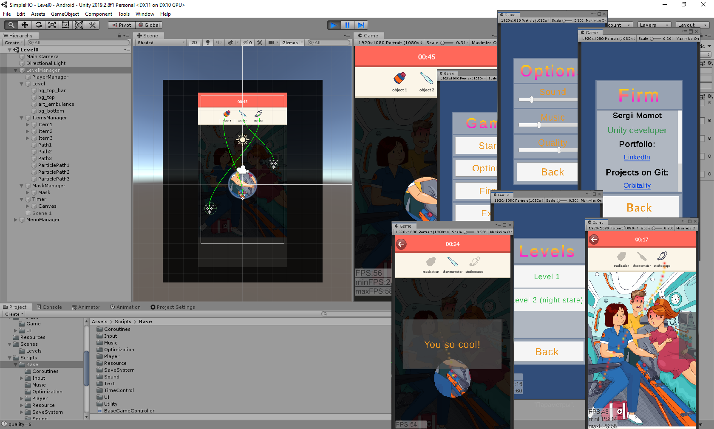

# SimpleHO
Simple Hidden Objects

## Task:
- Make the basic mechanics of the game in the genre “Hidden objects”:
https://play.google.com/store/search?q=Hidden%20objects&c=apps

Assemble a game scene with items to be found.
Make the top panel with items to search for in the game scene.
Tap on the found object on the stage, it should be highlighted and animatedly moved to the appropriate place in the objects panel with any visual effect.
Implement the search mode in the dark (darkened background, a circular “gap” in this background should follow the movement of the finger).
The game should contain a menu scene and gameplay.
There must be a timer in the gameplay scene. At the end of time (30 sec) the player loses.
There must be a popup of victory or defeat.
Saving points between sessions (accrual at random).
The game should look adequate at different aspect ratios.
Use the font that is in the assets folder.

## Implemented:
All

Additionally:
+ Sound, Music
+ TextMeshPro - for text
+ DOTween (free) - for move Ui, objects in game (https://assetstore.unity.com/packages/tools/animation/dotween-hotween-v2-27676)
+ PathCreator (free) - for move item by spline (https://assetstore.unity.com/packages/tools/utilities/b-zier-path-creator-136082)

## Unity 2019

